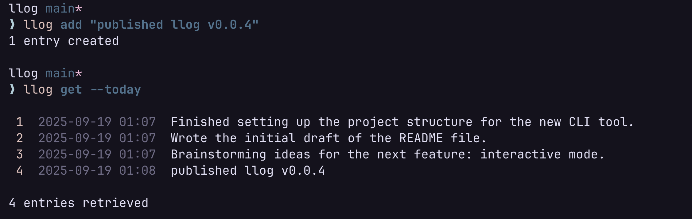

# llog

A simple life logger. Use it as your dev log or a timestamped journal.

All logs are stored locally in a SQLite file.



## Usage

### Adding Entry

```sh
llog add "trying out llog"

```

### Viewing Entry

- View all entries

```sh
llog get
```

- View entries from today

```sh
llog get --today
```

- View entries from yesterday

```sh
llog get --yesterday
```

- View entries since September 2025

```sh
llog get --from 2025-09-01
```

- View entries until September 2025

```sh
llog get --to 2025-09-01
```

- View entries from a specific date range

```sh
llog get --from 2025-09-01 --to 2025-09-31
```

## WIP

These are features I plan to add:

- `llog summarize`: Summarizing entries with an LLM (can be useful to summarize a day for a standup meeting)
- `llog config`: Viewing config and db locations
- `llog reset`: Deleting all entries from data
